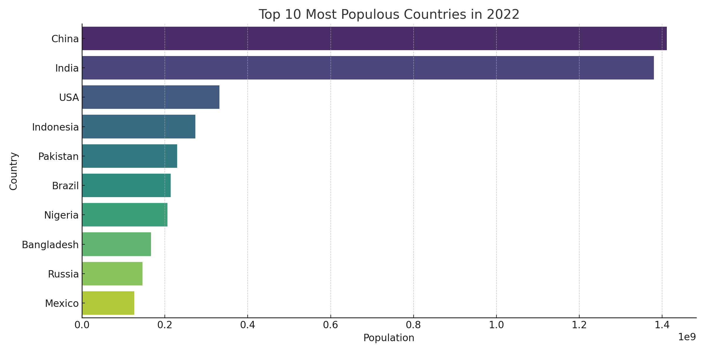

# CODECRAFT_DS_01: Population Distribution Analysis

This project visualizes the **top 10 most populous countries** in the year 2022 using World Bank data.

## 📊 Dataset Used
- **Source**: [World Bank - SP.POP.TOTL](https://data.worldbank.org/indicator/SP.POP.TOTL)
- **Downloaded CSV**: `API_SP.POP.TOTL_DS2_en_csv_v2.csv`

## 🔧 Tools & Libraries
- Python
- pandas
- matplotlib
- seaborn

## 📈 Output
A horizontal bar chart displaying the top 10 most populated countries in 2022.

## 🚀 How to Run
1. Download the dataset and save it as `API_SP.POP.TOTL_DS2_en_csv_v2.csv`
2. Open `population_analysis.ipynb` in Jupyter Notebook
3. Run all cells to generate the plot

## 📎 Output Chart
*(Optional: You can upload `chart.png` and link it here with `

` if you saved the plot as a PNG)*
